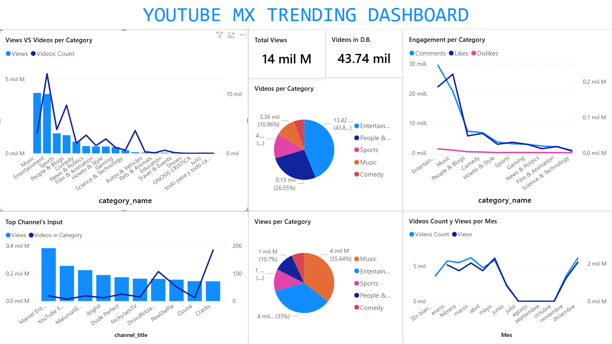

<h1 align="center">📊 YouTube MX ETL Analysis</h1>

  <b>ETL project analyzing YouTube data from Mexico to extract insights on trends, channels, and video performance.</b> 
  This project automates the extraction, transformation, and loading of YouTube data to generate clean datasets and interactive visualizations.

  

<h2>📄 Project Overview</h2>

  The goal of <b>YouTube MX ETL Analysis</b> is to explore trends, engagement metrics, and performance of YouTube channels and videos in Mexico. 
  The project implements a full ETL pipeline:
  data extraction from APIs or CSV sources, transformation and cleaning in Python, and visualization in Power BI or Excel.

<h2>⚙️ Workflow</h2>
<ol>
  <li><b>Extract:</b> Data pulled from Kaggle containing video metrics, channel info, views, likes, comments, and publication dates.</li>
  <li><b>Transform:</b> Performed in Python using pandas and Jupyter Notebook:
    <ul>
      <li>Data cleaning: remove duplicates, handle missing values, standardize formats.</li>
      <li>Feature engineering: computed engagement ratios, top trending categories, and growth metrics.</li>
      <li>Aggregated data by channel, category, and date for comparative analysis.</li>
    </ul>
  </li>
  <li><b>Load & Visualize:</b> Imported cleaned data into Power BI :
    <ul>
      <li>Interactive dashboards with top channels, top videos, and engagement trends.</li>
      <li>Filters for category, upload date, and popularity metrics.</li>
      <li>Comparison visuals to highlight the most impactful creators and trends in the Mexican YouTube ecosystem.</li>
    </ul>
  </li>
</ol>

<h2>📁 Repository Contents</h2>
<ul>
  <li><code>notebooks/</code> — Jupyter Notebook(s) with ETL code (<code>youtube_mx_etl.ipynb</code>).</li>
  <li><code>data/</code> — Cleaned CSV datasets ready for visualization (<code>youtube_mx_clean.csv</code>).</li>
  <li><code>powerbi/</code> — Power BI dashboard file (<code>.pbix</code>) or Excel dashboards.</li>
  <li><code>assets/</code> — Screenshots of dashboard (<code>youtube_mx_dashboard.png</code>).</li>
</ul>

<h2>🔎 Key Insights & Features</h2>
<ul>
  <li>Top trending channels and videos in Mexico by views, likes, and engagement rate.</li>
  <li>Comparison of video performance across categories (music, gaming, vlogs, etc.).</li>
  <li>Temporal analysis of uploads to identify peak periods for engagement.</li>
  <li>Data pipeline reusable for future YouTube datasets or other regions.</li>
</ul>

<h2>🛠️ How to Reproduce</h2>
<ol>
  <li>Install dependencies (Python 3.x, pandas, requests, Jupyter Notebook).</li>
  <li>Run <code>ipynb</code> to extract, transform, and save cleaned datasets.</li>
  <li>Load the CSV into Power BI to recreate the dashboard visuals.</li>
</ol>

<h2>📁 Data Source</h2>

  Data collected from the <a href="https://www.kaggle.com/datasets/datasnaek/youtube-new" target="_blank">Kaggle.com</a> and publicly available CSV datasets for Mexican YouTube statistics.

<h2>📄 License</h2>

  MIT License — free to use, modify, and share with attribution.

